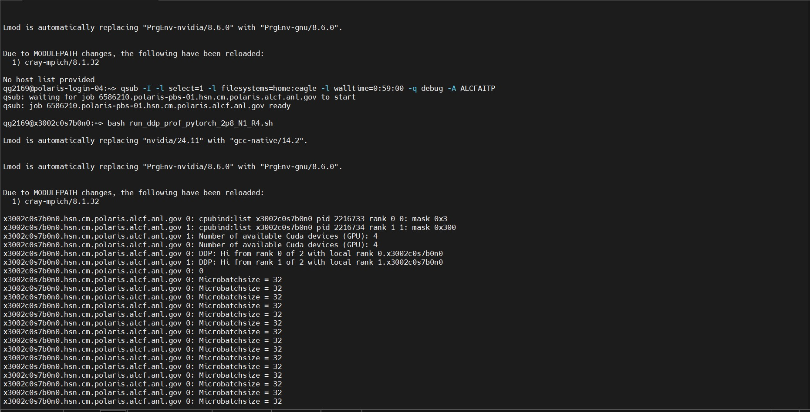
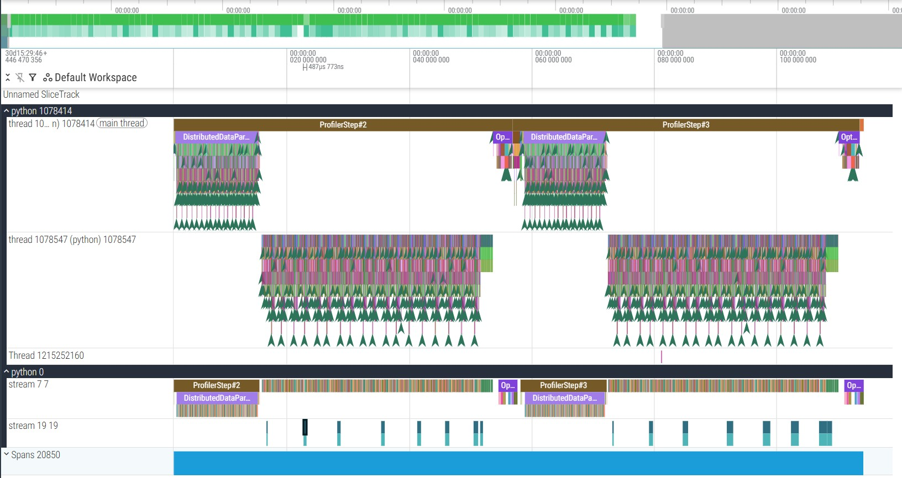
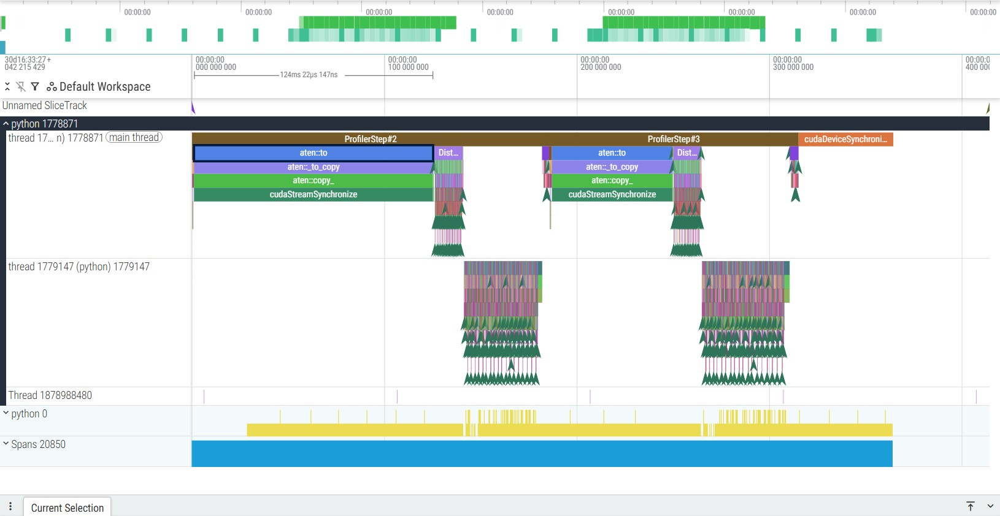
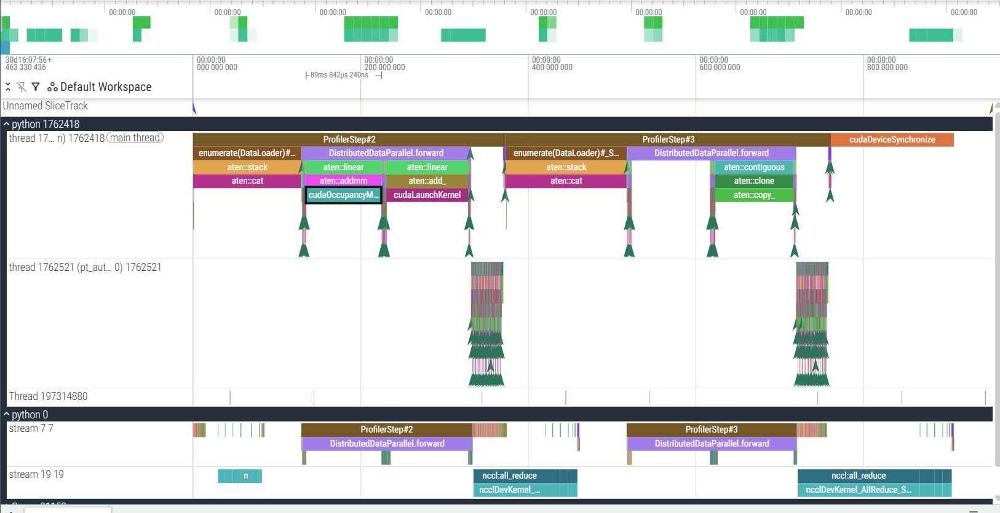
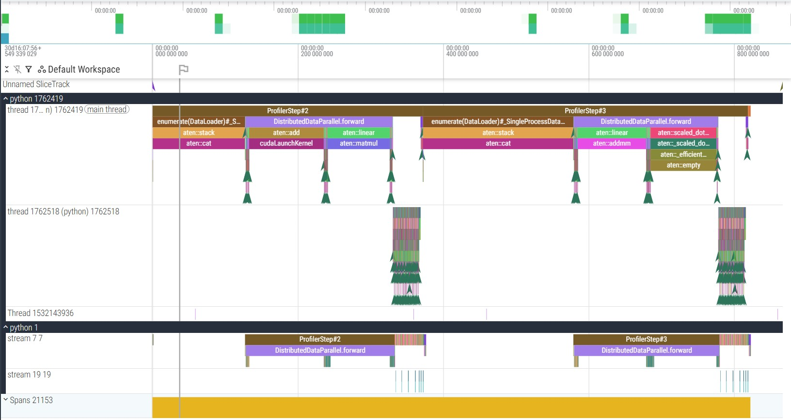
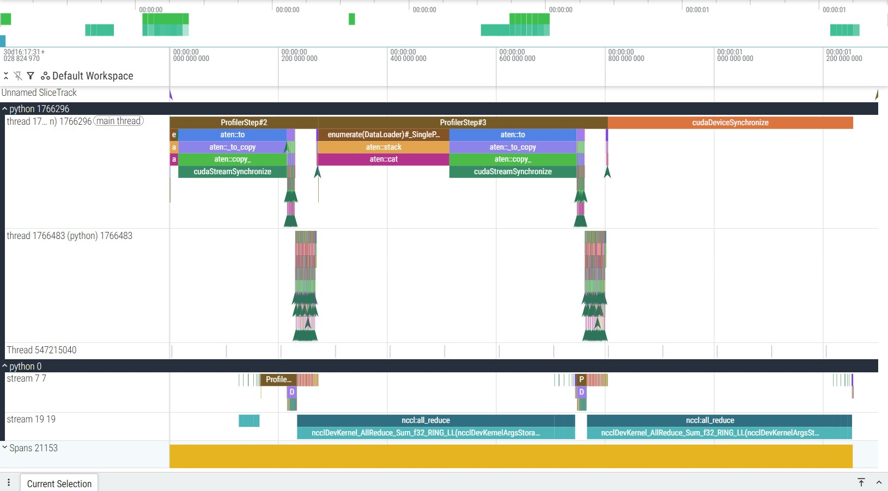
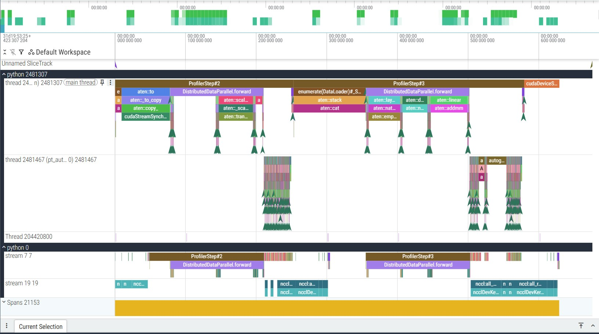

# Homework 1 

Author: Quan Gan

## Counting Device with torch.cuda.device_count()

Using the function torch.cuda.device_count() and insert in the [modified code](./pytorch_2p8_ddp_prof_mod.py).
The result is shown as follows 

## Running under different Dimension

All the following runs are under signle node with two ranks. For each GPU, 2 cores were assigned to it.

|  | src | tgt | runtime |
| --- | --- | --- | --- |
| 1 | (2048,1,512) | (2048,20,512) | 10.48s |
| 2 | (2048,20,512) | (2048,20,512) | 11.42s |
| 3 | (2048,200,512) | (2048,200,512) | 127.78s |
| 4 | (2048,20,256) | (2048,200,256) | 120.15s |
| 5 | (2048,20,512) | (2048,100,512) | 118.50s |
| 6 | (2048,20,512) | (2048,50,512) | 11.52s |

The result shows when the dimension grows larger, the running time is bottle necked by I/O and the CPU power, evidence will be present in the following sections 

## Collective communication between nodes

This section compares the configuration with 2 ranks run on a single node and 2 ranks run on separate nodes. In both cases teh src=torch.rand((2048,20,512) and tgt=torch.rand((2048,20,512). In single node case, the running time is 11.42s and for 2 nodes case, the running time is 37.40s. The 2 nodes case runs almost 4 times longer 

  
  
<em>Figure 1: Tracing Profile for 1 Node Case</em>

 
 
<figure>
  
  
<em>Figure 2: Tracing Profile for 2 Nodes Case</em>

</figure>

In 2 nodes case, significant amount of time is spent on the communication between nodes. The cudaStreamSynchronize and cudaDeviceSynchronize take most of the time in single GPU, while actual training time takes only half of it. for In conclusion, running on seperate nodes will increase the communication cost.

## Large Dimension Bottle Neck

When the size of the data is large, namely when the sequence size is equal or more than 100. The time grows significantly as shown in Figure 4 and Figure 4. When running under single node with 2 ranks, src=torch.rand((2048,20,512), and tgt=torch.rand((2048,100,512), it takes 118.50s to run the training. The process cudaOccupancyMaxActiveBlocksPerMultiprocessor, dataloader, tensor computing, and sychronization takes much longer time than small scale cases. 
<figure>  
  
  
<em>Figure 3: Tracing Profile for the 1st Rank</em>

</figure>
 
 
<figure>
  
  
<em>Figure 4:Tracing Profile for the 2nd Rank</em>

</figure>

To mitigate the problem one could either increasing the number of ranks or increasing the number of CPU cores assign to each rank. Both method could reduce the running time to around 67s-68s. 
<figure>  
  
  
<em>Figure 5: Tracing Profile for 4 Ranks Case</em>

</figure>

As Figure 5 shows, by adding 2 more GPU to run, the cudaOccupancyMaxActiveBlocksPerMultiprocessor process vanishes, and computation time is decreased for each GPU. However, the total communication and synchronizing time has increased. 

<figure>
  
  
<em>Figure 6:Tracing Profile for 3 CPU Cores for Each Rank Case</em>

</figure>

Figure 4 demonstrates assign one more CPU core to the GPU (we assign 2 cores per GPU by default), the dataloading and optimization time decreases, which help to decrease the total running time to 67s.

## Effect of Datatypes

Under large dimension, the random generated data and the hdf5 data loading process are compared. Both cases are run under large data set where src=torch.rand((2048,20,512), and tgt=torch.rand((2048,100,512). 
<figure>  
  
  
<em>Figure 7: Data Generated by Code</em>

</figure>

<figure>
  
  
<em>Figure 8:Data Read from hdf5</em>

</figure>

