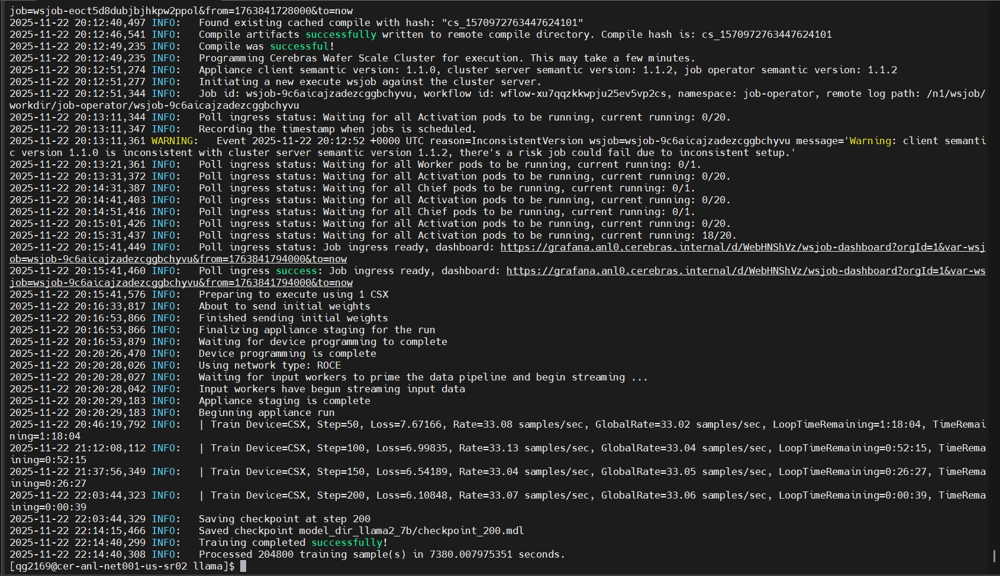

# Homework 5 

Author: Quan Gan

## Cerebras Homework

For this homework, we test the batch size of 512, 1024, and 2048 when using Cerebras to train the 7b Llma model. The following is the result of them
 
  
<em>Figure 1: Batch Size = 1024 </em>

 
 
<figure>
  
  
<em>Figure 2: Batch Size = 512 </em>

</figure>

When the batch size reduced, the total time is also reduced.

## SambaNova Homework

Through asking the question "Explain Rayleigh–Taylor instability" using globus interface, both Metis and Sophia take less an a second to think. 
However, Sophia is noticablly slower and takes around a minutes to print out the answer while Metis accomplish the same task within a second. 
It is likely because the SambaNova's architecture and API is optimized for inference service. In addition, SambraNova does not require allocation,
which also accelerate the answering speed.
